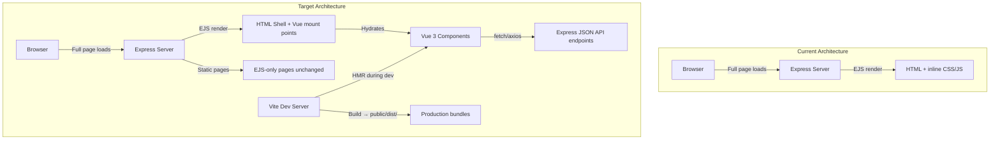

# Progressive Vue 3 + Vite Integration into Express/EJS Codebase

Migrate the frontend incrementally to Vue 3 + Vite, preserving the existing Express server-side rendering, routes, controllers, auth, and database layer. Vue components replace inline-heavy interactive sections; inline styles (814 occurrences across 22 EJS files) are extracted to proper CSS classes.

## User Review Required

> [!IMPORTANT]
> **This is a large incremental migration, not a full SPA rewrite.** Express continues to render EJS pages. Vue "islands" are mounted onto specific DOM nodes within those pages for interactive features. No existing URL changes, no auth flow changes, no database changes.

> [!WARNING]
> **Inline style extraction alone is a significant change.** Some views like `compare-frames.ejs` (151 inline styles), `frame-details.ejs` (88), `try-on-history.ejs` (82), and `trending.ejs` (76) will need careful visual regression testing after extraction.

## Open Questions

> [!IMPORTANT]
> **Phased vs. all-at-once?** The plan is organized into 5 phases. Should I execute all phases before requesting review, or would you prefer to review after each phase?

> [!NOTE]
> **Vue component granularity for virtual try-on.** The `virtual-try-on.ejs` (1,570 lines, 59 inline styles) contains camera handling, face detection, canvas rendering, and live mirror. Should each of these be a separate Vue component, or should the entire try-on be one large Vue component with internal composition?

## Architecture Overview



---

## Phase 1: Foundation — Vite + Vue 3 Scaffold

Set up the build tooling alongside the existing Express app without changing any existing functionality.

### [NEW] `client/` directory (Vue 3 + Vite project root)

Create a `client/` directory at the project root containing the Vite + Vue 3 scaffold:

#### [NEW] [vite.config.js](file:///c:/Users/Anindya%20Dasgupta/OneDrive/Documents/CSE471%20Project/client/vite.config.js)
- Configure Vite with `@vitejs/plugin-vue`
- Set `build.outDir` to `../public/dist/` so built assets land in Express's static directory
- Configure `build.rollupOptions` for multi-page entry points (one entry per interactive page: try-on, catalog, cart, checkout, etc.)
- Dev server proxy: forward `/api/*`, `/customer/*`, `/admin/*` to Express on port 3000

#### [NEW] [client/src/main.js](file:///c:/Users/Anindya%20Dasgupta/OneDrive/Documents/CSE471%20Project/client/src/main.js)
- Global Vue app bootstrapper that scans for `[data-vue-component]` attributes in the DOM and mounts the corresponding Vue component
- This "island architecture" pattern means each EJS page can opt-in to Vue by adding a mount point div

#### [NEW] [client/src/components/](file:///c:/Users/Anindya%20Dasgupta/OneDrive/Documents/CSE471%20Project/client/src/components/)
- Empty directory, populated in later phases

#### [NEW] [client/package.json](file:///c:/Users/Anindya%20Dasgupta/OneDrive/Documents/CSE471%20Project/client/package.json)
- Dependencies: `vue@3`, `@vitejs/plugin-vue`, `vite`
- Scripts: `dev`, `build`, `preview`

---

### [MODIFY] [package.json](file:///c:/Users/Anindya%20Dasgupta/OneDrive/Documents/CSE471%20Project/package.json)
- Add convenience scripts: `"client:dev"`, `"client:build"`, `"dev"` (runs both Express + Vite concurrently)
- Add `concurrently` as a dev dependency

### [MODIFY] [header.ejs](file:///c:/Users/Anindya%20Dasgupta/OneDrive/Documents/CSE471%20Project/views/partials/header.ejs)
- Add conditional `<script type="module" src="/dist/main.js">` tag (or Vite dev server URL in development)
- Pass a `data-vue-props` JSON blob on the `<main>` element so Vue components can pick up server-rendered data (user, frame, etc.)

---

## Phase 2: Inline Style Extraction

Extract all 814 inline `style="..."` attributes from 22 EJS files into proper, named CSS classes in organized stylesheet files.

### [NEW] [public/css/components/](file:///c:/Users/Anindya%20Dasgupta/OneDrive/Documents/CSE471%20Project/public/css/components/)
Create component-scoped CSS files to replace inline styles:

#### [NEW] `frame-details.css` — Styles for customization panel, lens tint swatches, review section, similar frames grid
#### [NEW] `virtual-try-on.css` — Camera states, processing overlay, live mirror HUD, result controls
#### [NEW] `cart.css` — Empty state, table cells, quantity stepper padding, mobile card layout
#### [NEW] `checkout.css` — Form labels, payment option cards, order summary panel
#### [NEW] `catalog.css` — Filter bar, wishlist button, availability badges, empty state
#### [NEW] `compare-frames.css` — Side-by-side comparison panels, diff highlights, stat bars
#### [NEW] `try-on-history.css` — History cards, thumbnail grid, deletion confirmation
#### [NEW] `trending.css` — Trending badges, popularity meters, card overlays
#### [NEW] `orders.css` — Order tracking timeline, status badges, order cards
#### [NEW] `ai-recommendations.css` — Recommendation cards, loading skeletons, suggestion panels
#### [NEW] `for-you.css` — Personalized feed cards, score indicators
#### [NEW] `mfs-verification.css` — Verification steps, QR display, status indicators
#### [NEW] `payment-success.css` — Confirmation card, animated checkmark

### Files modified (inline styles → CSS classes)

High-impact files (each with >40 inline styles):

| File | Inline Styles | Priority |
|------|:---:|:---:|
| [compare-frames.ejs](file:///c:/Users/Anindya%20Dasgupta/OneDrive/Documents/CSE471%20Project/views/customer/compare-frames.ejs) | 151 | 🔴 Critical |
| [frame-details.ejs](file:///c:/Users/Anindya%20Dasgupta/OneDrive/Documents/CSE471%20Project/views/customer/frame-details.ejs) | 88 | 🔴 Critical |
| [try-on-history.ejs](file:///c:/Users/Anindya%20Dasgupta/OneDrive/Documents/CSE471%20Project/views/customer/try-on-history.ejs) | 82 | 🔴 Critical |
| [trending.ejs](file:///c:/Users/Anindya%20Dasgupta/OneDrive/Documents/CSE471%20Project/views/customer/trending.ejs) | 76 | 🔴 Critical |
| [virtual-try-on.ejs](file:///c:/Users/Anindya%20Dasgupta/OneDrive/Documents/CSE471%20Project/views/customer/virtual-try-on.ejs) | 59 | 🟡 High |
| [mfs-verification.ejs](file:///c:/Users/Anindya%20Dasgupta/OneDrive/Documents/CSE471%20Project/views/customer/mfs-verification.ejs) | 52 | 🟡 High |
| [cart.ejs](file:///c:/Users/Anindya%20Dasgupta/OneDrive/Documents/CSE471%20Project/views/customer/cart.ejs) | 47 | 🟡 High |
| [order-tracking.ejs](file:///c:/Users/Anindya%20Dasgupta/OneDrive/Documents/CSE471%20Project/views/customer/order-tracking.ejs) | 46 | 🟡 High |
| [for-you.ejs](file:///c:/Users/Anindya%20Dasgupta/OneDrive/Documents/CSE471%20Project/views/customer/for-you.ejs) | 46 | 🟡 High |
| [ai-recommendations.ejs](file:///c:/Users/Anindya%20Dasgupta/OneDrive/Documents/CSE471%20Project/views/customer/ai-recommendations.ejs) | 44 | 🟡 High |

Lower-impact files (≤33 inline styles each): `my-orders.ejs` (33), `checkout.ejs` (32), `payment-success.ejs` (22), `wishlist.ejs` (12), `frame-catalog.ejs` (8), and 6 others with <5 each.

### [MODIFY] [header.ejs](file:///c:/Users/Anindya%20Dasgupta/OneDrive/Documents/CSE471%20Project/views/partials/header.ejs)
- Add `<link>` tags for the new component CSS files (conditionally loaded per page using EJS variables, or loaded as a single concatenated bundle)

### CSS Naming Convention

All extracted classes follow a **BEM-like convention** scoped by feature:
- `.fd-customization-panel` (frame-details customization panel)
- `.tryon-status-banner` (virtual try-on status banner)  
- `.cart-empty-icon` (cart empty state icon)
- `.checkout-form-label` (checkout form label)

This prevents conflicts with the existing `style.css` and `bootstrap-integration.css` classes.

---

## Phase 3: Vue Component Conversion — Interactive Islands

Convert the most interactive, JavaScript-heavy EJS sections into Vue 3 Single File Components (SFCs). These are mounted as "islands" within the EJS shell pages.

### Customer-facing Vue Components

#### [NEW] [client/src/components/FrameCatalog/](file:///c:/Users/Anindya%20Dasgupta/OneDrive/Documents/CSE471%20Project/client/src/components/FrameCatalog/)
- `FrameCatalogGrid.vue` — Reactive filter/search/sort with instant client-side filtering (replaces the inline `<script>` in `frame-catalog.ejs`)
- `FrameCard.vue` — Individual frame card with wishlist toggle
- `CatalogFilters.vue` — Shape, material, availability, sort, search controls

**Data flow**: Server renders initial `frames[]` and `wishlistIds[]` as JSON in a `data-vue-props` attribute. Vue hydrates and handles all filtering client-side. Wishlist toggle calls `/customer/wishlist/add|remove` via `fetch`.

#### [NEW] [client/src/components/VirtualTryOn/](file:///c:/Users/Anindya%20Dasgupta/OneDrive/Documents/CSE471%20Project/client/src/components/VirtualTryOn/)
- `TryOnContainer.vue` — Main orchestrator (state machine: default → camera → processing → result)
- `CameraCapture.vue` — Camera access, capture button, video element
- `LiveMirror.vue` — Live mirror with real-time face tracking canvas overlay
- `PhotoResult.vue` — Result display with frame overlay, save/retake controls
- `FaceShapeAnalysis.vue` — Face shape detection results panel

**Data flow**: Frame data passed via props from EJS. Camera/Canvas logic uses existing `public/js/` utilities (`face-shape-estimator.js`, `frame-overlay-processor.js`, `virtual-mirror.js`) imported directly.

#### [NEW] [client/src/components/Cart/](file:///c:/Users/Anindya%20Dasgupta/OneDrive/Documents/CSE471%20Project/client/src/components/Cart/)
- `CartView.vue` — Full cart page with reactive quantity updates, item removal, running totals
- `CartItem.vue` — Individual item row/card (responsive: table row on desktop, card on mobile)
- `QuantityStepper.vue` — Reusable +/- quantity control
- `CartSummary.vue` — Order summary sidebar with discount calculation

**Data flow**: Initial `cartItems[]` from server props. Quantity/remove operations call existing Express POST endpoints, Vue updates UI optimistically.

#### [NEW] [client/src/components/FrameDetails/](file:///c:/Users/Anindya%20Dasgupta/OneDrive/Documents/CSE471%20Project/client/src/components/FrameDetails/)
- `CustomizePanel.vue` — Color/lens tint selection with visual preview
- `LensTintSwatches.vue` — Tint swatch buttons with overlay preview
- `ReviewSection.vue` — Star ratings, review form, review list with pagination
- `SimilarFrames.vue` — Similar frames carousel

#### [NEW] [client/src/components/Checkout/](file:///c:/Users/Anindya%20Dasgupta/OneDrive/Documents/CSE471%20Project/client/src/components/Checkout/)
- `CheckoutForm.vue` — Delivery details + payment method selection
- `PaymentMethodSelector.vue` — COD/Stripe/SSLCommerz radio cards
- `OrderSummary.vue` — Read-only summary with totals

#### [NEW] [client/src/components/shared/](file:///c:/Users/Anindya%20Dasgupta/OneDrive/Documents/CSE471%20Project/client/src/components/shared/)
- `GlassPanel.vue` — Reusable glassmorphism container
- `StatusBadge.vue` — In Stock / Out of Stock badge
- `EmptyState.vue` — Reusable empty state with icon, message, CTA
- `LoadingSpinner.vue` — Animated spinner overlay
- `Toast.vue` — Toast notification for async operations

### EJS Mount Point Pattern

Each EJS file that contains a Vue island will follow this pattern:

```html
<%- include('../partials/header') %>
<div class="dashboard-layout">
    <%- include('../partials/customer-sidebar') %>
    <section class="dashboard-content container-fluid">
        <!-- Vue mounts here -->
        <div id="vue-frame-catalog"
             data-vue-component="FrameCatalogGrid"
             data-vue-props='<%- JSON.stringify({ frames, wishlistIds, currentSort }) %>'>
            <!-- Server-rendered fallback / loading skeleton -->
            <div class="loading-skeleton">Loading catalog...</div>
        </div>
    </section>
</div>
<%- include('../partials/footer') %>
```

The EJS file becomes a thin shell. The Vue component receives all its data via `data-vue-props` and takes over the DOM node.

---

## Phase 4: Inline Script Extraction

Move all `<script>` blocks embedded in EJS files into proper JavaScript modules.

### Files with inline `<script>` blocks to extract

| EJS File | Script Blocks | Target |
|----------|:---:|---|
| `virtual-try-on.ejs` | 6 | Vue component `<script setup>` + composables |
| `ai-recommendations.ejs` | 3 | `AiRecommendations.vue` component |
| `nearby-stores.ejs` | 2 | `NearbyStores.vue` (Leaflet map integration) |
| `frame-details.ejs` | 2 | `FrameDetails` Vue components |
| `compare-frames.ejs` | 1 | `CompareFrames.vue` component |
| `checkout.ejs` | 1 | `CheckoutForm.vue` component |
| `cart.ejs` | 1 | `CartView.vue` component |
| `frame-catalog.ejs` | 1 | `FrameCatalogGrid.vue` component |
| `wishlist.ejs` | 1 | `WishlistGrid.vue` component |
| `for-you.ejs` | 1 | `ForYouFeed.vue` component |
| `my-orders.ejs` | 1 | `MyOrders.vue` component |
| `mfs-verification.ejs` | 1 | `MfsVerification.vue` component |
| `order-tracking.ejs` | 1 | `OrderTracking.vue` component |
| `try-on-history.ejs` | 1 | `TryOnHistory.vue` component |

### [NEW] [client/src/composables/](file:///c:/Users/Anindya%20Dasgupta/OneDrive/Documents/CSE471%20Project/client/src/composables/)
Shared reactive logic extracted as Vue composables:
- `useCamera.js` — Camera access, stream management, capture
- `useFaceDetection.js` — Face landmark detection, wraps existing `face-shape-estimator.js`
- `useFrameOverlay.js` — Frame overlay rendering, wraps existing `frame-overlay-processor.js`
- `useWishlist.js` — Toggle wishlist, optimistic UI update
- `useCart.js` — Add/remove/update cart items, totals calculation
- `useToast.js` — Global toast notification state

---

## Phase 5: JSON API Endpoints

Add lightweight JSON API routes for Vue components that need asynchronous data. **No existing routes are changed or removed.**

### [MODIFY] [customerRoutes.js](file:///c:/Users/Anindya%20Dasgupta/OneDrive/Documents/CSE471%20Project/routes/customerRoutes.js)

Add new API endpoints (all under `/customer/api/`):

```
GET  /customer/api/frames          → All frames (JSON)
GET  /customer/api/frame/:id       → Single frame + reviews (JSON)
GET  /customer/api/cart             → Cart items (JSON)
POST /customer/api/cart/add         → Add to cart (JSON response)
POST /customer/api/cart/update      → Update quantity (JSON response)
POST /customer/api/cart/remove      → Remove item (JSON response)
GET  /customer/api/wishlist         → Wishlist frame IDs (JSON)
POST /customer/api/wishlist/toggle  → Toggle wishlist (JSON response)
GET  /customer/api/orders           → User orders (JSON)
POST /customer/api/reviews/submit   → Submit review (JSON response)
```

> [!NOTE]
> Many existing POST routes (e.g., `/customer/cart/add`, `/customer/wishlist/add`) already return redirects or HTML. The new `/api/` routes return JSON and are used **only by Vue components**. Existing routes are untouched and remain functional for any non-Vue fallback.

### [MODIFY] [customerController.js](file:///c:/Users/Anindya%20Dasgupta/OneDrive/Documents/CSE471%20Project/controllers/customerController.js)
- Add new controller methods that return `res.json(...)` instead of `res.render(...)`
- Reuse the exact same `db.*` calls that the existing render methods already use

---

## Pages Left Unchanged (EJS-only, no Vue)

These pages are simple enough that Vue adds no value:

| Page | Reason |
|------|--------|
| `home.ejs` | Static hero, 2 buttons, no interactivity |
| `about.ejs` | Static content |
| `contact.ejs` | Simple form, native submission |
| `login.ejs` | Simple form, native submission |
| `signup.ejs` | Simple form with file upload, native submission |
| `forgot-password.ejs` | Simple form |
| `reset-password.ejs` | Simple form |
| `403.ejs` | Error page |
| All admin views | Data tables with server-rendered CRUD, low interactivity |
| `customer/dashboard.ejs` | Simple stat cards, no dynamic interaction |
| `customer/profile.ejs` | Simple form |
| `payment.ejs` | Redirect handler |

These pages will still benefit from **Phase 2 (inline style extraction)** but get no Vue components.

---

## File Structure After Migration

```
CSE471 Project/
├── app.js                          # Unchanged
├── client/                         # NEW — Vue 3 + Vite
│   ├── package.json
│   ├── vite.config.js
│   └── src/
│       ├── main.js                 # Island bootstrapper
│       ├── components/
│       │   ├── shared/             # GlassPanel, Toast, EmptyState, etc.
│       │   ├── FrameCatalog/       # Grid, Card, Filters
│       │   ├── FrameDetails/       # Customize, Reviews, Similar
│       │   ├── VirtualTryOn/       # TryOn, Camera, Mirror, Result
│       │   ├── Cart/               # CartView, CartItem, Stepper
│       │   ├── Checkout/           # Form, PaymentSelector, Summary
│       │   └── ...                 # Other feature components
│       └── composables/            # useCamera, useCart, useWishlist, etc.
├── controllers/                    # Add API methods, keep render methods
├── middleware/                     # Unchanged
├── models/                         # Unchanged
├── public/
│   ├── css/
│   │   ├── style.css               # Existing — kept as-is
│   │   ├── bootstrap-integration.css  # Existing — kept as-is
│   │   └── components/             # NEW — extracted inline styles
│   │       ├── frame-details.css
│   │       ├── virtual-try-on.css
│   │       ├── cart.css
│   │       └── ...
│   ├── dist/                       # NEW — Vite build output
│   │   ├── main.js
│   │   └── main.css
│   ├── js/                         # Existing — kept, imported by Vue
│   └── images/
├── routes/                         # Add /api/ routes, keep existing
├── utils/                          # Unchanged
└── views/
    ├── partials/                   # header/footer updated for Vue script tags
    ├── customer/                   # EJS shells with Vue mount points
    └── admin/                      # Unchanged
```

---

## Proposed Changes

### Summary of all file changes

| Action | Count | Description |
|--------|:---:|---|
| **[NEW]** | ~35 | Vite config, Vue components, composables, CSS files |
| **[MODIFY]** | ~22 | EJS files (extract inline styles, add mount points) |
| **[MODIFY]** | 3 | `customerRoutes.js`, `customerController.js`, `header.ejs` |
| **[NEW]** | 1 | `client/` directory with Vue scaffold |
| **[DELETE]** | 0 | No files deleted |

---

## Verification Plan

### Automated Tests
```bash
# Build check — Vue components compile without errors
cd client && npm run build

# Express server starts successfully with new routes
node app.js

# Existing test suite still passes
npm test
```

### Manual Verification
- Start both servers (`npm run dev`) and navigate every customer page
- Verify all interactive features work: catalog filter/search, wishlist toggle, cart CRUD, checkout flow, virtual try-on camera/capture/mirror
- Compare visual output before/after inline style extraction using side-by-side screenshots
- Test on mobile viewport (sidebar collapse, responsive layouts)
- Verify auth flow is unaffected (login, logout, JWT cookie, role-based redirects)
- Confirm admin pages are completely unaffected
